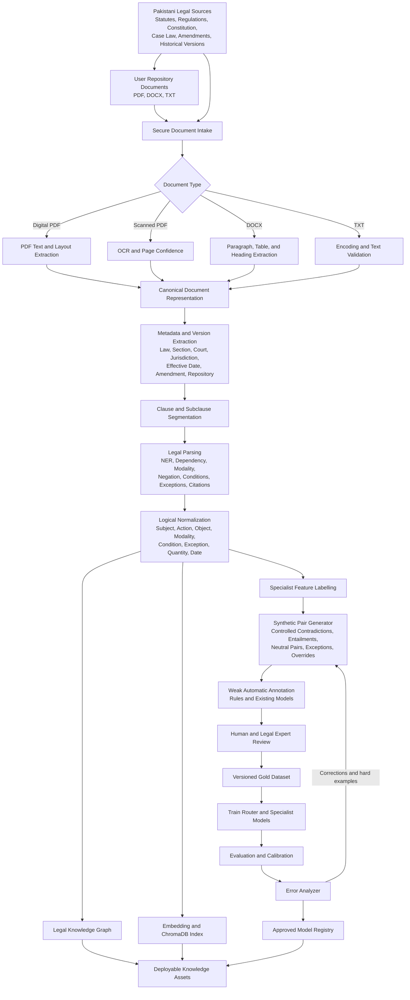

# PakLaw AI Multi-Expert Architecture and Data Pipeline

## Executive Summary

PakLaw AI is an NLI-based law consistency checker for Pakistani legal
documents. Its objective is to detect contradictions, overlaps, exceptions,
temporal conflicts, numerical conflicts, and other inconsistencies between:

- Pakistani statutes, regulations, constitutional provisions, and amendments.
- Case law and legal precedents where suitable structured data is available.
- Historical versions of laws.
- Draft clauses entered or uploaded by a user.
- Documents stored in a user's repository.

A single LegalBERT or DeBERTa model should not be expected to solve every part
of this problem. Transformer models are useful for semantic similarity and
natural-language inference, but they are not dependable calculators, date
engines, formal logic solvers, citation resolvers, or legal-precedence engines.

The proposed system therefore uses a **hybrid multi-expert architecture**:

1. Deterministic parsers extract exact facts such as numbers, units, dates,
   negation cues, citations, and legal modalities.
2. A multi-label router identifies all reasoning skills required by a clause.
3. Specialist experts analyze the same clause pair in parallel.
4. A defeasible legal reasoner combines the expert findings with statutory
   hierarchy, specificity, jurisdiction, exceptions, and amendment history.
5. A calibrated decision layer produces a consistency result, confidence,
   evidence, citations, and an explanation trace.
6. Ambiguous or low-confidence decisions are marked **Expert Review Required**.

This document describes a planned backend architecture. The current project
contains the Next.js frontend, Firebase Authentication, Firestore rules, and
browser-based repository metadata. The FastAPI services, document extraction,
vector database, specialist experts, and reasoning engine described here are
the intended backend implementation.

---

## 1. Problem Analysis

### 1.1 Why a Single Model Is Insufficient

Legal consistency checking is not one classification task. A pair of clauses
may require several independent forms of reasoning.

| Reasoning Type | Example | Why General NLI Alone Is Risky |
|---|---|---|
| Semantic | "Property may be seized" vs. "Authorities can confiscate property" | Requires paraphrase and contextual meaning. Transformers are useful here. |
| Numeric | "Fine up to Rs. 500,000" vs. "Fine up to Rs. 1,000,000" | Exact values, scales, ranges, and units must be normalized and compared. |
| Temporal | "Within 30 days" vs. "Within 60 days" | Requires duration parsing and interval comparison rather than token similarity. |
| Amendment history | An amendment from 2025 changes a provision from 2018 | Requires version metadata and Lex Posterior reasoning. |
| Deontic | "The authority shall approve" vs. "The authority may approve" | `Shall`, `may`, and `shall not` represent different legal force. |
| Negation | "A licence is required" vs. "No licence is required" | Small polarity cues can reverse the legal effect of an otherwise similar sentence. |
| Conditional | "A permit is required unless X" | The exception changes the rule only under a specific condition. |
| Propositional | `(A and B) -> C` vs. `A -> not C` | Requires structured logical comparison and satisfiability checking. |
| Citation | "Subject to Section 14" | Meaning depends on resolving another provision and its version. |
| Precedence | A specific cybercrime law conflicts with a general penal provision | Apparent contradiction may be resolved by Lex Specialis or legal hierarchy. |

A transformer may predict a relationship without preserving arithmetic,
temporal, or logical correctness. Conversely, a symbolic engine can compare
normalized values and rules but cannot reliably understand paraphrases or
implicit legal meaning. PakLaw AI therefore combines both approaches.

### 1.2 Core Objectives

The architecture must:

- Preserve each clause's source, section, page, repository, and version.
- Retrieve relevant comparison candidates without comparing every clause.
- Detect all reasoning categories required by each candidate pair.
- Route a pair to multiple experts instead of selecting one exclusive model.
- Prefer deterministic results for arithmetic, dates, units, and explicit
  logical constraints.
- Use LegalBERT/DeBERTa for semantic NLI and contextual interpretation.
- Apply Pakistani legal hierarchy, Lex Specialis, and Lex Posterior.
- Distinguish a true contradiction from an exception or lawful override.
- Produce evidence-backed and reviewable explanations.
- Abstain when evidence is incomplete or experts strongly disagree.

### 1.3 Inputs

| Input | Examples |
|---|---|
| Official legal corpus | Constitution, Pakistan Penal Code, PECA, ATA, regulations |
| Legislative history | Amendments, commencement dates, repealed versions |
| Case law | Judgments and precedents with court and date metadata |
| User repository | PDF, DOC, DOCX, and TXT documents selected by the user |
| Direct draft | Clause text pasted into the consistency-check interface |
| Multi-file comparison | Two to seven user-provided documents |
| Search query | Keywords, section references, questions, or clause text |

### 1.4 Outputs

Each analysis should return:

- Relationship: `consistent`, `contradiction`, `overlap`, `exception`,
  `superseded`, `unrelated`, or `expert_review_required`.
- Conflict category: semantic, numerical, temporal, deontic, negation,
  conditional, citation, hierarchy, or combined.
- Confidence and calibration information.
- Proposed clause and comparison clause.
- Normalized facts used by each expert.
- Applicable legal principles and precedence rules.
- Supporting citations and exact source locations.
- A step-by-step reasoning trace.
- Warnings about missing metadata, unavailable experts, or uncertainty.

### 1.5 Important Limitations

- The system assists legal review; it does not provide binding legal advice.
- OCR errors can alter legally significant words, digits, or negations.
- Legal interpretation may depend on facts outside the document corpus.
- Case law can distinguish, narrow, or invalidate an apparently clear rule.
- Synthetic training data cannot replace expert-labelled Pakistani legal data.
- Model confidence is not the same as legal correctness.
- The system must abstain rather than invent missing citations or reasoning.

---

## 2. Architectural Principles

### 2.1 Hybrid Neural-Symbolic Design

The system divides responsibilities according to the type of certainty needed:

- **Neural models** handle semantic representation, paraphrase, broad
  retrieval, contextual NLI, and difficult language classification.
- **Deterministic tools** handle exact values, dates, citations, explicit
  negation, units, and document provenance.
- **Symbolic reasoning** handles propositional rules, satisfiability,
  conditions, exceptions, and precedence policies.
- **Knowledge graphs** connect laws, sections, amendments, citations, courts,
  versions, and override relationships.

### 2.2 Multi-Label Routing

The router does not force a clause into one category. It assigns zero or more
specialist labels. For example:

> A person must submit an appeal within 30 days unless the court grants an
> extension under Section 14.

This clause requires:

- Temporal Expert: `within 30 days`.
- Deontic Expert: `must submit`.
- Conditional Logic Expert: `unless`.
- Citation Expert: `Section 14`.
- Semantic NLI Expert: compare the complete meaning.
- Legal Precedence Expert: evaluate whether Section 14 provides a valid
  exception.

### 2.3 Provenance First

Every extracted clause, derived fact, model prediction, and final decision must
retain a link to its source. No generated explanation may introduce a legal
claim that cannot be traced to:

- Original document identifier.
- Repository or official corpus identifier.
- Law, section, subsection, and page.
- Effective date and version.
- Character offsets or evidence span.
- Expert output or legal rule that produced the claim.

### 2.4 Abstention Over False Certainty

The system should return `expert_review_required` when:

- Required source metadata is missing.
- OCR confidence is too low around critical text.
- A citation cannot be resolved.
- Specialist experts materially disagree.
- The semantic model is uncertain.
- A legal hierarchy or jurisdiction cannot be established.
- A required expert is unavailable and no safe fallback exists.

---

## 3. Offline Data Pipeline

The offline pipeline creates the legal corpus, training datasets, vector index,
knowledge graph, specialist resources, and evaluation sets. It runs when new
documents or corrections are introduced, not on every user query.



### 3.1 Secure Document Intake

The intake service:

- Authenticates the uploader.
- Associates user documents with a repository and owner.
- Validates file type using both extension and content signature.
- Enforces file-size and document-count limits.
- Computes a cryptographic hash for deduplication and audit purposes.
- Scans documents for malicious payloads.
- Stores the original file separately from derived text.
- Creates an immutable document identifier and processing job identifier.

Official corpus documents are marked as system-owned. Repository documents are
private to their owner unless an explicit sharing model is introduced later.

### 3.2 Extraction and OCR

#### Digital PDFs

The extractor should preserve:

- Page number.
- Reading order.
- Headings and section boundaries.
- Footnotes.
- Tables where penalties, schedules, or dates may appear.
- Character offsets connecting extracted text to the source.

#### Scanned PDFs

OCR output must include token- or line-level confidence. Critical tokens receive
special validation:

- Negation: `not`, `no`, `unless`.
- Modalities: `shall`, `may`, `must`.
- Digits and currency.
- Dates and section numbers.

If confidence for a critical token falls below a configured threshold, the
clause is flagged for review instead of silently entering the gold corpus.

#### DOCX and TXT

DOCX extraction should retain headings, paragraphs, tables, lists, and tracked
structure where available. TXT ingestion must detect encoding and preserve
Unicode text.

### 3.3 Canonical Document Representation

All document formats are converted to a single internal representation:

```text
Document
  -> Pages or structural blocks
  -> Sections and subsections
  -> Clauses
  -> Evidence spans and metadata
```

The canonical representation prevents each downstream expert from needing its
own PDF or DOCX parser.

### 3.4 Metadata and Version Extraction

Required metadata should include:

| Category | Fields |
|---|---|
| Identity | Document ID, title, source filename, checksum |
| Legal structure | Law name, part, chapter, section, subsection, schedule |
| Authority | Legislature, court, ministry, issuing body |
| Jurisdiction | Federal, provincial, territorial, institutional |
| Time | Enactment, publication, commencement, amendment, repeal dates |
| Version | Version ID, predecessor, successor, status |
| Repository | Owner UID, repository ID, privacy scope |
| Provenance | Page, paragraph, offsets, extraction method, OCR confidence |

Historical versions must never overwrite one another. They are linked through
`AMENDS`, `REPEALS`, `SUPERSEDES`, or `HAS_VERSION` relationships.

### 3.5 Clause Segmentation

Segmentation must respect legal structure rather than splitting only at full
stops. It should recognize:

- Sections and subsections.
- Numbered and lettered lists.
- Provisos.
- Explanations and illustrations.
- Exceptions.
- Schedules.
- Definitions spanning multiple sentences.
- Semicolons that separate independent legal requirements.

Each clause receives a stable ID derived from the document version and
structural location.

### 3.6 Legal Parsing

The parsing stage extracts:

- Legal entities and defined terms.
- Persons, authorities, courts, offences, actions, and objects.
- Section, article, schedule, and act references.
- Deontic modalities.
- Negation scope.
- Conditions, exceptions, and provisos.
- Quantities, currency, percentages, ratios, ages, durations, and ranges.
- Dates, deadlines, effective periods, and relative time expressions.
- Dependency structure and semantic roles.

Model-based extraction may be used, but critical exact values are verified by
deterministic patterns and normalization libraries.

### 3.7 Logical Normalization

Each clause is transformed into structured facts without discarding the
original text.

Example source:

> A licensee shall submit the report within 30 days unless the Authority
> grants an extension.

Example normalized form:

```yaml
subject: licensee
action: submit
object: report
modality: obligation
polarity: affirmative
condition: null
deadline:
  relation: within
  value: 30
  unit: day
exception:
  trigger: unless
  proposition: Authority grants extension
```

The system may additionally produce a formal representation:

```text
Licensee(x) AND NOT ExtensionGranted(x)
  -> OBLIGATED(Submit(x, Report), within=30_days)
```

### 3.8 Synthetic Dataset Generation

Synthetic data increases coverage of rare conflict types. It must be generated
through controlled transformations, not unconstrained paraphrasing alone.

| Transformation | Source | Synthetic Pair |
|---|---|---|
| Numeric conflict | Fine up to Rs. 500,000 | Fine up to Rs. 1,000,000 |
| Range conflict | Age must be at least 18 | Age must be below 18 |
| Temporal conflict | Appeal within 30 days | Appeal within 60 days |
| Modality change | Authority may approve | Authority shall approve |
| Negation | Licence is required | Licence is not required |
| Condition removal | Required if X applies | Required in all cases |
| Exception injection | Prohibited | Prohibited except for Y |
| Entity swap | Federal Government | Provincial Government |
| Citation mutation | Section 14 | Section 15 |
| Temporal precedence | Older rule | Later amendment |

Synthetic examples must retain labels describing how they were created. They
must not be treated as authoritative legal text.

### 3.9 Automatic and Human Annotation

Weak labels can be proposed using:

- Numeric and date comparison rules.
- Negation and modality rules.
- Citation links.
- Existing NLI models.
- Amendment and hierarchy metadata.
- Formal-logic satisfiability checks.

Human reviewers then verify:

- The relationship label.
- Conflict category.
- Evidence spans.
- Applicable exceptions.
- Legal precedence.
- Whether the example requires external factual context.

The evaluation test set must be independently reviewed and kept separate from
synthetic templates and training documents.

### 3.10 Knowledge Graph Construction

Suggested node types:

- Law.
- Version.
- Section.
- Clause.
- Definition.
- Entity.
- Court.
- Judgment.
- Jurisdiction.
- Repository document.

Suggested edge types:

- `CONTAINS`.
- `CITES`.
- `DEFINES`.
- `AMENDS`.
- `REPEALS`.
- `SUPERSEDES`.
- `INTERPRETS`.
- `APPLIES_TO`.
- `EXCEPTION_TO`.
- `MORE_SPECIFIC_THAN`.
- `SAME_SUBJECT_AS`.

The graph supports citation expansion, multi-hop retrieval, legal hierarchy,
Lex Specialis, and Lex Posterior.

### 3.11 Vector Index Construction

Each clause is embedded and stored in ChromaDB with:

- Clause ID.
- Original and normalized text.
- Law and section.
- Version and effective dates.
- Jurisdiction.
- Repository ID and owner scope.
- Clause categories.
- Source page and offsets.

Official and repository documents may use separate collections or strict
metadata filters. A repository search must never retrieve another user's
private clauses.

### 3.12 Dataset and Model Versioning

Every deployment should record:

- Dataset version.
- Corpus snapshot.
- Normalizer version.
- Router version.
- Specialist model versions.
- Knowledge graph version.
- Vector index version.
- Threshold and calibration version.

This enables reproducibility and identifies which component produced a result.

---

## 4. Online Multi-Expert Architecture

The online pipeline handles a user search, single-clause audit, repository
audit, or multi-file comparison.

```mermaid
flowchart LR
    UI["Next.js Frontend<br/>Search, Single Audit, Multi-File Audit"] --> AUTH["Firebase Authentication<br/>Owner and Repository Scope"]
    AUTH --> API["FastAPI Gateway<br/>Validation, Rate Limits, Job ID"]

    API --> INPUT["Input Normalizer<br/>Text or Extracted Documents"]
    INPUT --> RET["Hybrid Candidate Retrieval"]

    subgraph Retrieval["Retrieval Layer"]
        RET --> META["Metadata and Repository Filters"]
        RET --> VEC["Sentence Embeddings and ChromaDB"]
        RET --> KG["Citation and Knowledge Graph Expansion"]
        META --> RERANK["Cross-Encoder Reranker"]
        VEC --> RERANK
        KG --> RERANK
    end

    RERANK --> PAIRS["Candidate Clause Pairs"]
    PAIRS --> ROUTER["Multi-Label Clause Router<br/>Detectors plus Learned Classifier"]

    subgraph Experts["Parallel Specialist Experts"]
        ROUTER --> NUM["Numeric Expert"]
        ROUTER --> TIME["Temporal Expert"]
        ROUTER --> DEO["Deontic Expert"]
        ROUTER --> NEG["Negation Expert"]
        ROUTER --> LOGIC["Conditional and<br/>Propositional Logic Expert"]
        ROUTER --> NLI["LegalBERT or DeBERTa<br/>Semantic NLI Expert"]
        ROUTER --> CITE["Citation Expert"]
        ROUTER --> PREC["Legal Precedence Expert"]
        ROUTER --> GEN["General Semantic Expert"]
    end

    NUM --> MERGE["Evidence and Result Merger"]
    TIME --> MERGE
    DEO --> MERGE
    NEG --> MERGE
    LOGIC --> MERGE
    NLI --> MERGE
    CITE --> MERGE
    PREC --> MERGE
    GEN --> MERGE

    MERGE --> REASON["Defeasible Legal Reasoner<br/>Hierarchy, Specificity, Time,<br/>Conditions and Exceptions"]
    REASON --> CAL["Decision Aggregation<br/>Calibration and Abstention"]
    CAL -->|Sufficient confidence| EXPLAIN["Grounded Explanation Expert"]
    CAL -->|Low confidence or disagreement| REVIEW["Expert Review Required"]
    REVIEW --> EXPLAIN
    EXPLAIN --> REPORT["Conflict Report<br/>Evidence, Citations, Trace, Confidence"]
    REPORT --> UI

    REPORT --> AUDIT["Audit Log and Feedback Store"]
    AUDIT --> OFFLINE["Offline Error Analysis<br/>and Dataset Improvement"]
```



### 4.1 API and Authentication Layer

The FastAPI gateway should:

- Verify the Firebase ID token.
- Derive the user ID from the token rather than trusting request data.
- Confirm access to a selected repository.
- Validate text, file references, limits, and requested operation.
- Assign a trace ID and analysis job ID.
- Apply rate limits and timeouts.
- Return structured errors without exposing model or storage internals.

### 4.2 Input Normalization

Direct clause text is parsed immediately. Uploaded files should normally be
processed by the offline ingestion service first. The analysis request then
uses canonical document and clause IDs rather than repeatedly parsing files.

For an interactive temporary multi-file analysis, the same extraction and
normalization pipeline may run in a temporary isolated workspace.

### 4.3 Hybrid Candidate Retrieval

Candidate generation combines:

1. **Metadata filtering**
   - Repository scope.
   - Jurisdiction.
   - Law or act.
   - Effective date.
   - Document status.

2. **Direct reference lookup**
   - Explicit sections, articles, schedules, and cited laws.

3. **Vector retrieval**
   - Semantic similarity over normalized and original clause text.
   - Broad retrieval, such as top 20 candidates.

4. **Knowledge graph expansion**
   - Cited provisions.
   - Definitions.
   - Amendments.
   - Exceptions and interpretations.

5. **Cross-encoder reranking**
   - Re-score candidate pairs with the original query or proposed clause.
   - Retain a smaller high-precision set, such as top 5.

Search scope behavior:

- `All PakLaw Statutes`: retrieve from the authorized official corpus.
- Selected repository: retrieve only from the selected user's repository.
- Consistency audit with repository: compare the draft against that repository.
- Multi-file analysis: compare only the uploaded temporary document set.

### 4.4 Multi-Label Clause Router

The router combines deterministic feature detectors with a learned multi-label
classifier.

#### Deterministic features

- Numeric tokens, currency, percentages, measurements, ranges, and scale words.
- Dates, durations, deadlines, and temporal operators.
- Modal verbs and deontic phrases.
- Negation cues.
- Conditional and exception markers.
- Explicit legal citations.
- Parentheses, conjunctions, and logical operators.

#### Learned features

A compact DeBERTa multi-label classifier can detect implicit categories that
rules may miss, such as:

- Implicit obligation.
- Hidden exception.
- Complex conditional structure.
- Semantic definition.
- Jurisdiction or legal-domain category.

The final routing labels are the union of high-confidence deterministic and
learned signals. Safety-critical deterministic labels should not be removed by
the classifier.

### 4.5 Specialist Experts

| Specialist | Responsibility | Proposed Technique | Key Output |
|---|---|---|---|
| Numeric Expert | Amounts, limits, percentages, ratios, penalties, ages, durations | Regex/NER, unit normalization, decimal arithmetic, interval comparison | Normalized values and relation |
| Temporal Expert | Dates, effective periods, deadlines, amendments | Date parser, interval algebra, version metadata | Temporal relation and applicable version |
| Deontic Expert | Obligations, permissions, prohibitions | Fine-tuned DeBERTa plus rule normalization | Modality and legal-force mismatch |
| Negation Expert | Explicit/implicit negation and scope | Negation detector plus dependency parsing | Polarity and negated proposition |
| Conditional Logic Expert | Conditions, exceptions, nested rules | Structured parser, propositional representation, Z3 | Compatible, contradictory, or satisfiable rule sets |
| Semantic NLI Expert | Entailment, contradiction, neutral | Fine-tuned LegalBERT/DeBERTa NLI | Label, probabilities, evidence |
| Citation Expert | Acts, sections, cross-references, amendments | Legal NER plus knowledge graph | Resolved citation and version |
| Legal Precedence Expert | Hierarchy, Lex Specialis, Lex Posterior, jurisdiction | Defeasible rules plus knowledge graph | Applicable rule and override reason |
| General Semantic Expert | Ordinary clauses without special exact reasoning | Embeddings plus general legal NLI | Semantic relation |
| Explanation Expert | Human-readable grounded result | Templates over verified expert outputs | Explanation, trace, citations, warnings |

#### Numeric Expert

The Numeric Expert must normalize:

- Pakistani Rupees and scale words such as thousand, lakh, million, and crore.
- Percentages and ratios.
- Inclusive and exclusive ranges.
- Minimum and maximum values.
- Ages and sentence durations.
- Cardinal and ordinal references.
- Units and unit conversions.

It should use exact decimal arithmetic. A model may identify the role of a
number, but it should not perform the final calculation.

#### Temporal Expert

The Temporal Expert handles:

- Absolute dates.
- Relative periods such as `within 30 days`.
- Effective and expiry dates.
- Amendment and repeal sequences.
- Overlapping or disjoint validity intervals.
- Retroactive application where metadata explicitly supports it.

It outputs both the temporal comparison and the version of law applicable to
the requested date.

#### Deontic Expert

The expert maps legal language into:

- Obligation.
- Permission.
- Prohibition.
- Discretion.
- Recommendation.
- No stated modality.

It compares the holder, action, object, condition, and modality. `May` versus
`shall` should be reported as a legal-force difference, not automatically as a
direct contradiction.

#### Negation Expert

This expert identifies the scope of negation:

```text
"The authority may not disclose records."
```

It must distinguish this from:

```text
"The authority may disclose records not marked confidential."
```

The location and dependency scope of `not` change the proposition being
negated.

#### Conditional and Propositional Logic Expert

The expert converts normalized clauses into propositions and checks:

- Whether two rule sets can be true together.
- Whether one rule entails another.
- Whether conditions overlap.
- Whether an exception neutralizes an apparent contradiction.
- Whether a contradiction exists only in a reachable legal state.

Example:

```text
Rule A: Licensed(x) AND FeePaid(x) -> PERMITTED(Operate(x))
Rule B: Licensed(x) -> PROHIBITED(Operate(x))
```

For a licensed person who paid the fee, both permission and prohibition apply,
so the pair is a candidate conflict unless precedence resolves it.

Z3 or another SMT solver may be used after translating the legal rule into a
restricted supported logic. Unsupported or ambiguous translations must be
flagged rather than silently simplified.

#### Semantic NLI Expert

LegalBERT or DeBERTa remains important for:

- Paraphrase-aware entailment.
- Contextual contradiction.
- Neutral or unrelated classification.
- Implicit meaning not captured by surface rules.

The model should be fine-tuned on Pakistani legal clause pairs and evaluated
separately by conflict category. Its output is evidence for the aggregator, not
the final legal judgment.

#### Citation Expert

The Citation Expert:

- Resolves explicit and abbreviated references.
- Selects the correct law version.
- Expands definitions and provisos when required.
- Detects broken, missing, circular, or ambiguous citations.
- Returns source text and provenance for downstream reasoning.

#### Legal Precedence Expert

The planned priority order should be configurable rather than hard-coded into
the model. It considers:

- Constitutional hierarchy.
- Federal and provincial jurisdiction.
- Enabling and delegated legislation.
- Court hierarchy and decision date for case law.
- Specific versus general provisions.
- Later versus earlier enactments.
- Express repeal or amendment.
- Savings and transitional clauses.

This expert can convert a raw contradiction into:

- Valid exception.
- Superseded provision.
- Jurisdictional separation.
- Unresolved legal conflict.

#### Explanation Expert

The Explanation Expert must generate text only from the structured decision and
verified evidence. It should not independently reinterpret the law.

Recommended explanation structure:

1. Decision.
2. Clauses compared.
3. Exact differences.
4. Specialist findings.
5. Applicable exception or precedence rule.
6. Confidence and uncertainty.
7. Citations.
8. Review recommendation.

---

## 5. Conceptual Data Interfaces

These schemas define the information exchanged between components. They are
conceptual and can later be implemented as Pydantic models.

### 5.1 `DocumentMetadata`

```yaml
document_id: string
owner_uid: string | null
repository_id: string | null
source_type: official | repository | temporary_upload
title: string
law_name: string | null
document_type: statute | regulation | constitution | case_law | draft | other
jurisdiction: string | null
authority: string | null
version_id: string
status: active | amended | repealed | draft | unknown
enactment_date: date | null
effective_from: date | null
effective_to: date | null
source_file: string
checksum: string
extraction_method: digital | ocr | docx | text
extraction_confidence: number
created_at: datetime
```

### 5.2 `NormalizedClause`

```yaml
clause_id: string
document_id: string
version_id: string
section: string | null
subsection: string | null
page: integer | null
original_text: string
normalized_text: string
subject: [string]
action: [string]
object: [string]
modality: obligation | permission | prohibition | discretion | none
polarity: affirmative | negative
conditions: [LogicalExpression]
exceptions: [LogicalExpression]
quantities: [NormalizedQuantity]
temporal_expressions: [NormalizedTime]
citations: [Citation]
jurisdiction: string | null
evidence_offsets:
  start: integer
  end: integer
```

### 5.3 `ClauseFeatures`

```yaml
clause_id: string
has_numeric: boolean
has_temporal: boolean
has_deontic: boolean
has_negation: boolean
has_condition: boolean
has_exception: boolean
has_citation: boolean
has_complex_logic: boolean
detected_domains: [string]
ocr_risk: boolean
metadata_completeness: number
```

### 5.4 `RoutingDecision`

```yaml
pair_id: string
experts:
  - expert: numeric
    selected_by: deterministic | classifier | both
    confidence: number
required_experts: [string]
optional_experts: [string]
router_version: string
warnings: [string]
```

### 5.5 `ExpertResult`

```yaml
pair_id: string
expert: string
status: success | unavailable | unsupported | error
relationship: string | null
confidence: number | null
facts: object
evidence_spans: [EvidenceSpan]
reason_codes: [string]
model_or_rule_version: string
warnings: [string]
latency_ms: integer
```

### 5.6 `CandidateConflict`

```yaml
pair_id: string
source_clause_id: string
candidate_clause_id: string
retrieval_score: number
rerank_score: number
retrieval_reasons: [semantic | citation | metadata | knowledge_graph]
routing: RoutingDecision
expert_results: [ExpertResult]
```

### 5.7 `AggregatedDecision`

```yaml
pair_id: string
decision: consistent | contradiction | overlap | exception | superseded | unrelated | expert_review_required
conflict_categories: [string]
confidence: number
calibration_version: string
applicable_clause_id: string | null
legal_principles: [string]
reasoning_trace: [ReasoningStep]
supporting_experts: [string]
dissenting_experts: [string]
missing_experts: [string]
review_required: boolean
review_reasons: [string]
```

### 5.8 `ExplanationReport`

```yaml
analysis_id: string
scope:
  type: official_corpus | repository | temporary_files
  repository_id: string | null
summary:
  findings: integer
  high: integer
  medium: integer
  low: integer
findings:
  - decision: AggregatedDecision
    source_clause: NormalizedClause
    comparison_clause: NormalizedClause
    explanation: string
    citations: [ResolvedCitation]
    uncertainty: string | null
provenance:
  dataset_version: string
  corpus_version: string
  model_versions: object
  generated_at: datetime
```

---

## 6. Routing and Decision Logic

### 6.1 Router Pseudocode

```python
def route_pair(clause_a, clause_b):
    features = detect_features(clause_a, clause_b)
    learned_labels = router_model.predict_multilabel(clause_a, clause_b)

    experts = {"semantic_nli"}

    if features.has_numeric:
        experts.add("numeric")
    if features.has_temporal:
        experts.add("temporal")
    if features.has_deontic:
        experts.add("deontic")
    if features.has_negation:
        experts.add("negation")
    if features.has_condition or features.has_exception:
        experts.add("conditional_logic")
    if features.has_citation:
        experts.add("citation")
        experts.add("legal_precedence")
    if features.requires_version_or_hierarchy:
        experts.add("legal_precedence")

    experts.update(labels_above_threshold(learned_labels))

    if experts == {"semantic_nli"}:
        experts.add("general_semantic")

    return RoutingDecision(
        experts=experts,
        required_experts=determine_required_experts(features),
        warnings=feature_warnings(features),
    )
```

### 6.2 Parallel Execution Pseudocode

```python
async def execute_experts(pair, routing):
    tasks = [
        expert_registry[name].analyze(pair)
        for name in routing.experts
        if name in expert_registry
    ]

    results = await gather_with_timeout(tasks)

    for required in routing.required_experts:
        if not successful_result_exists(results, required):
            results.append(unavailable_result(required))

    return results
```

### 6.3 Aggregation Rules

The aggregator combines evidence using the following principles:

1. Deterministic exact comparisons take priority for their supported domain.
2. Semantic NLI supplies contextual relationship but cannot override verified
   arithmetic, dates, or resolved citations.
3. Conditions and exceptions are evaluated before labelling a direct conflict.
4. Precedence is evaluated before presenting two valid provisions as an
   unresolved contradiction.
5. Unsupported logic translations lower confidence.
6. Missing required experts trigger review.
7. Strong expert disagreement triggers review.
8. Confidence is calibrated using held-out validation data rather than raw
   model probability alone.

Example:

```text
Numeric Expert: contradiction, 1.00
Semantic NLI: entailment, 0.68
Temporal Expert: not applicable
Precedence Expert: no override found, 0.91

Final result: numerical contradiction
Reason: Both clauses regulate the same penalty under the same conditions, but
the exact maximum amounts differ. The semantic similarity score cannot override
the verified numerical mismatch.
```

### 6.4 Suggested Decision Thresholds

Initial thresholds are design defaults and must be calibrated:

| Condition | Result |
|---|---|
| Confidence >= 0.85 and no material disagreement | Return automated decision |
| Confidence 0.65-0.84 | Return decision with uncertainty warning |
| Confidence < 0.65 | Expert Review Required |
| Required expert unavailable | Expert Review Required |
| Exact expert and semantic expert conflict | Follow exact expert for its domain and flag disagreement |
| Precedence cannot resolve applicable law | Expert Review Required |
| OCR risk affects critical token | Expert Review Required |

### 6.5 Graceful Degradation

| Failure | Safe Behavior |
|---|---|
| Numeric Expert unavailable | Do not make an automated numeric-conflict decision |
| Temporal Expert unavailable | Mark version/deadline findings for review |
| NLI model unavailable | Continue exact checks, but do not claim general semantic consistency |
| Knowledge graph unavailable | Use vector retrieval; mark citations and precedence as incomplete |
| Reranker unavailable | Use vector ranking with reduced-confidence warning |
| Citation unresolved | Preserve citation text and require review |
| Explanation service unavailable | Return structured facts and evidence without generated prose |

---

## 7. Defeasible Legal Reasoning

Legal rules are defeasible because a general rule can be defeated by a valid
exception, later amendment, more specific law, or higher authority.

### 7.1 Reasoning Order

For each candidate conflict:

1. Confirm both clauses address compatible subjects, actions, and conditions.
2. Resolve definitions and citations.
3. Establish jurisdiction and legal authority.
4. Determine the version effective at the relevant time.
5. Check express amendment, repeal, or savings clauses.
6. Check legal hierarchy.
7. Check Lex Specialis.
8. Check Lex Posterior.
9. Evaluate conditions, exceptions, and reachable states.
10. Aggregate semantic, exact, and symbolic evidence.

### 7.2 Example: Apparent Conflict Resolved by Exception

```text
General rule:
No person may enter the restricted area.

Specific rule:
An emergency medical officer may enter the restricted area while responding
to a declared emergency.
```

The semantic model may identify contradiction. The Conditional Logic and Legal
Precedence experts identify that the second clause is a specific exception.
The final decision is `exception`, not `contradiction`.

### 7.3 Example: Temporal Supersession

```text
2018 provision: Appeal must be filed within 30 days.
2025 amendment: Appeal must be filed within 45 days.
```

If both clauses belong to the same law and the amendment is effective, the
Temporal and Precedence experts return `superseded`. If the user requests the
law applicable in 2020, the older provision may still be the correct result.

---

## 8. Repository-Aware Operation

### 8.1 Repository Ingestion

When a user uploads a document to a repository:

1. Firebase identity establishes ownership.
2. The backend creates document and processing records.
3. Extraction, normalization, and indexing run asynchronously.
4. The repository UI displays processing status.
5. Search and audit become available after indexing succeeds.

Repository storage must eventually move beyond current browser-only metadata.
The backend will need durable document, processing-status, clause, and index
records.

### 8.2 Repository Search

The frontend selector supplies a repository ID. The backend:

- Verifies ownership.
- Applies the repository filter before retrieval.
- Searches extracted clauses, not filenames alone.
- Returns source documents and locations.
- Returns an empty-index or processing message when appropriate.

### 8.3 Repository Consistency Audit

A user draft can be compared against:

- All official PakLaw statutes.
- One selected repository.
- A temporary group of uploaded files.

The scope is recorded in the final report so results cannot be mistaken for a
full-corpus analysis.

---

## 9. Training Strategy

### 9.1 Separate Training Objectives

Do not train one model on every target simultaneously without measuring task
interference. Recommended training units:

- Router multi-label classification.
- Semantic NLI classification.
- Deontic classification.
- Negation scope detection.
- Condition and exception extraction.
- Legal NER and citation extraction.
- Optional learned temporal or numeric role extraction.

Numeric comparison, date arithmetic, graph traversal, and satisfiability remain
deterministic.

### 9.2 Training Data Split

Split by document or law family rather than random clause pair alone. Otherwise,
near-duplicate sections may leak between training and evaluation.

Recommended partitions:

- Training set.
- Development/calibration set.
- In-domain test set.
- Cross-law generalization test set.
- Historical amendment test set.
- Repository-document robustness test set.
- Adversarial negation/numeric/conditional test set.

### 9.3 Class Balance

The dataset should cover:

- Entailment, contradiction, and neutral.
- True conflict versus valid exception.
- Numeric equality and inequality.
- Temporal overlap and supersession.
- Modal-strength differences.
- Negation scope.
- Explicit and implicit conditions.
- Resolvable and unresolvable citations.
- Easy and hard negatives.

Synthetic generation can balance rare classes, but final evaluation should
prioritize human-reviewed natural examples.

---

## 10. Evaluation and Validation Plan

### 10.1 Component Metrics

| Component | Primary Metrics | Required Analysis |
|---|---|---|
| Clause router | Precision, recall, F1 per expert label | Missed-expert rate is especially important |
| Extraction | Field-level precision, recall, exact match | Separate OCR and digital documents |
| Numeric Expert | Exact match and comparison accuracy | Currency, scale, range, percentage, duration |
| Temporal Expert | Date normalization and interval-relation accuracy | Deadlines, amendments, historical versions |
| Deontic Expert | Macro F1 | Obligation, permission, prohibition, discretion |
| Negation Expert | Cue and scope F1 | Explicit, implicit, and nested negation |
| Conditional Logic | Rule extraction F1 and solver correctness | Conditions, exceptions, nested logic |
| Semantic NLI | Macro F1 and confusion matrix | Entailment, contradiction, neutral |
| Retrieval | Recall@20 | Relevant legal clauses retrieved |
| Reranking | NDCG@5, MRR | Correct ordering of final candidates |
| Citation Expert | Resolution accuracy | Correct law, section, version, source |
| Precedence Expert | Rule accuracy | Hierarchy, specificity, time, jurisdiction |
| Calibration | ECE, Brier score, reliability diagram | Confidence must reflect observed accuracy |
| Explanation | Citation faithfulness and evidence coverage | No unsupported legal claims |

### 10.2 End-to-End Metrics

- Conflict detection precision, recall, and macro F1.
- Accuracy by conflict category.
- False-conflict rate for valid exceptions.
- Correct supersession rate.
- Expert-review recall for genuinely ambiguous cases.
- Citation correctness.
- Provenance completeness.
- Average and percentile latency.
- Percentage of results produced under degraded operation.

### 10.3 Baselines and Ablation Tests

The supervisor's central hypothesis should be tested directly.

Compare:

1. Single LegalBERT/DeBERTa NLI baseline.
2. Baseline plus hybrid retrieval.
3. Multi-expert system without precedence reasoning.
4. Multi-expert system without symbolic logic.
5. Multi-expert system without exact numeric/temporal experts.
6. Full proposed architecture.

Report whether specialist routing improves:

- Numeric and date conflict accuracy.
- Exception handling.
- Overall macro F1.
- Calibration.
- Explainability.
- False-positive rate.

### 10.4 Error Analysis Loop

Every evaluated error should be categorized:

- Retrieval failure.
- Routing failure.
- Extraction/OCR failure.
- Specialist failure.
- Logic translation failure.
- Precedence failure.
- Aggregation failure.
- Explanation or citation failure.
- Missing corpus knowledge.

Approved corrections become:

- New regression tests.
- Hard training examples.
- Updated parser rules.
- Knowledge graph corrections.
- Calibration data.

---

## 11. Security, Governance, and Auditability

### 11.1 Security

- Verify Firebase tokens at the API boundary.
- Enforce repository ownership in the backend and vector metadata filters.
- Encrypt stored documents and network traffic.
- Scan uploads.
- Sanitize filenames and generated report content.
- Apply strict file, request, and processing limits.
- Never log passwords, tokens, full private documents, or unnecessary PII.

### 11.2 Data Governance

- Track source licences and corpus provenance.
- Keep official and user-owned documents logically separated.
- Support deletion of user documents and their derived clauses/vectors.
- Record dataset consent and reviewer provenance.
- Maintain immutable legal versions.
- Rebuild affected graph/index entries when a document is corrected.

### 11.3 Audit Trail

Each analysis should log:

- User and repository scope using non-public identifiers.
- Input document/clause IDs.
- Candidate retrieval IDs and scores.
- Router selections.
- Expert versions and outputs.
- Applied legal rules.
- Final decision and threshold.
- Warnings and review status.
- Processing times.

---

## 12. Deployment Architecture

### 12.1 Logical Services

The FYP can begin as a modular monolith while retaining these ownership
boundaries:

| Module | Responsibility |
|---|---|
| FastAPI application | API, authentication, validation, orchestration |
| Ingestion worker | Extraction, OCR, segmentation, indexing |
| Retrieval service | ChromaDB, metadata filtering, graph expansion, reranking |
| Expert registry | Numeric, temporal, deontic, negation, logic, NLI experts |
| Reasoning service | Precedence, aggregation, calibration, abstention |
| Explanation service | Grounded report construction |
| Data stores | Document storage, metadata DB, ChromaDB, knowledge graph |
| Monitoring | Logs, metrics, traces, model and data versions |

These can later be separated into services if load or deployment requirements
justify it.

### 12.2 Recommended FYP Implementation Order

1. Canonical document and clause schemas.
2. PDF/DOCX/TXT extraction and provenance.
3. Metadata-aware ChromaDB retrieval.
4. Deterministic numeric and temporal experts.
5. Semantic NLI baseline.
6. Multi-label router.
7. Deontic, negation, and conditional extraction.
8. Basic precedence and version rules.
9. Aggregation, confidence, and review state.
10. Grounded explanation report.
11. Repository backend persistence.
12. Knowledge graph and advanced defeasible reasoning.

This order produces useful incremental demonstrations without requiring every
research component to be completed simultaneously.

---

## 13. Example End-to-End Analysis

### Input

Draft:

> An appeal shall be filed within 60 days of the order.

Retrieved active provision:

> An appeal shall be filed within 30 days of the order unless an extension is
> granted by the Court.

### Processing

1. Retrieval identifies the same legal subject and action.
2. Router selects temporal, deontic, conditional, semantic NLI, and precedence
   experts.
3. Temporal Expert finds `60 days != 30 days`.
4. Deontic Expert finds matching obligations.
5. Conditional Logic Expert finds the active provision contains an exception,
   but the exception does not generally change the default 30-day deadline.
6. Semantic NLI identifies strong overlap with a likely contradiction.
7. Citation and Precedence Experts confirm both rules apply in the same
   jurisdiction and no later amendment establishes 60 days.
8. Aggregator returns a temporal contradiction.

### Output

```yaml
decision: contradiction
conflict_categories:
  - temporal
confidence: 0.94
reason: >
  Both clauses impose the same filing obligation, but the proposed clause
  changes the default deadline from 30 to 60 days. The court-extension
  exception does not authorize a general 60-day deadline.
review_required: false
```

---

## 14. Final Architecture Decision

PakLaw AI should not use a single LegalBERT or DeBERTa model as the complete
legal reasoning engine. The selected architecture is a **hybrid, multi-label,
multi-expert neural-symbolic system**.

The design assigns:

- Exact facts to deterministic specialists.
- Formal conditions to symbolic logic.
- Semantic relationships to legal transformers.
- Citations and amendments to a knowledge graph.
- Legal hierarchy and exceptions to a defeasible reasoner.
- Final output to a calibrated aggregator and grounded explanation layer.

This architecture is more complex than a single-model pipeline, but it matches
the actual structure of legal consistency checking. It is also modular: the FYP
can implement a practical subset first, measure it against a single-model
baseline, and add experts as training data and time allow.
