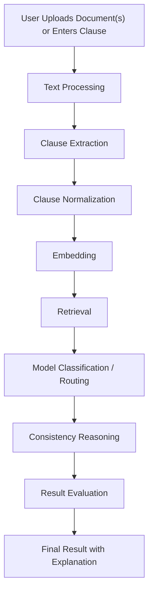
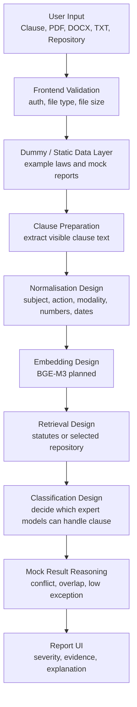

# Part 1 Pipeline Creation

## Purpose

Part 1 focuses on proving the system idea through a clear pipeline, frontend workflows, repository management, dummy data, and planned backend/AI architecture. It does not need to fully train every model yet. The purpose is to show how the system will work from user input to result and how clauses will later be routed to specialist models.

## Part 1 Scope

Part 1 should include:

1. Working frontend pages.
2. User authentication and profile flow.
3. Repository management.
4. Search laws page.
5. Consistency audit page.
6. Multi-file analysis page.
7. Mock report output.
8. Dummy legal data.
9. Simple pipeline diagram.
10. Detailed operational flow design.
11. Training pipeline design.
12. Justification for multi-expert routing.

## 2-3 Part Division

The whole project can be explained in three parts.

### Part 1 - Prototype and Pipeline Foundation

Goal:

Build the frontend and define the legal AI pipeline clearly.

Includes:

- Authentication
- Profile management
- Dashboard
- Search laws UI
- Repository UI
- Consistency audit UI
- Multi-file analysis UI
- Report UI
- Dummy legal data
- Part 1 test cases
- Simple pipeline and system-flow diagrams
- Backend/AI design documentation

Output:

The user can move through the complete system flow even though the backend AI is not fully connected yet.

### Part 2 - Backend and AI Integration

Goal:

Connect the frontend to a real backend that can store, process, index, and retrieve legal documents.

Includes:

- FastAPI backend
- Firebase token verification
- File upload storage
- OCR/text extraction
- Clause extraction
- Clause normalization
- Embedding generation
- ChromaDB/vector indexing
- Repository-scoped retrieval
- Model routing API
- Initial consistency reasoning

Output:

The system starts using real uploaded documents and real retrieved clauses instead of static dummy data.

### Part 3 - Advanced Reasoning, Evaluation, and Deployment

Goal:

Improve the system using specialist models, symbolic reasoning, evaluation matrices, and deployment-ready reporting.

Includes:

- Fine-tuned routing classifier
- NLI contradiction model
- Numeric/date/negation experts
- Propositional logic conversion
- Legal precedence reasoning
- Result evaluation metrics
- Report preservation
- Monitoring and model versioning
- Final deployment

Output:

The system can generate evidence-based consistency reports with confidence and traceable reasoning.

## Part 1 Simple Pipeline



## Detailed Part 1 Pipeline



## Dummy Data Needed in Part 1

Dummy data is used to show how the system behaves before the real backend is connected.

### Dummy Statute Data

| ID | Section | Title | Category | Example Use |
|---|---|---|---|---|
| `law1` | PPC Section 378 | Theft Definition | PPC | Semantic comparison and definition overlap |
| `law2` | PPC Section 379 | Punishment for Theft | PPC | Numeric contradiction in punishment duration |
| `law3` | PECA Section 14 | Unauthorized Use of Identity | PECA | Cyber law and identity misuse |
| `law4` | PECA Section 20 | Dignity of Natural Person | PECA | Defamation and privacy |
| `law5` | Constitution Article 24 | Property Rights | Constitution | Constitutional boundary issue |
| `law6` | Constitution Article 14 | Dignity of Man | Constitution | Human dignity and torture prohibition |
| `law7` | ATA Section 7 | Terrorism Punishment | ATA | Legal hierarchy and severity |

### Dummy Repository Data

```json
{
  "repository": {
    "id": "repo_university_rules",
    "name": "University Regulations",
    "description": "Academic rules, attendance policies, discipline clauses",
    "files": [
      {
        "id": "file_attendance_policy",
        "name": "Attendance Policy.pdf",
        "type": "application/pdf",
        "size": 245000,
        "uploadedAt": "2026-06-21T10:00:00Z"
      }
    ]
  }
}
```

### Dummy Clause Pair

```json
{
  "queryClause": "Whoever commits theft shall be punished for a term which may extend to five years.",
  "retrievedClause": "Whoever commits theft shall be punished for a term which may extend to three years.",
  "expectedResult": "contradiction",
  "reason": "Punishment duration changed from three years to five years."
}
```

## Part 1 Deliverables

| Deliverable | Status Type | Explanation |
|---|---|---|
| Frontend pages | Implemented / prototype | Pages exist and demonstrate user flow |
| Dummy law search | Implemented / prototype | Static law examples show search behavior |
| Repository UI | Implemented / prototype | Repositories and file metadata stored locally |
| Consistency audit UI | Implemented / prototype | Input and file validation available |
| Mock report | Implemented / prototype | Shows expected output structure |
| Pipeline diagrams | Design | Explain future backend/AI flow |
| Training pipeline | Design | Explains how models and data will be prepared |
| Operational pipeline | Design | Explains deployed runtime flow |

## What Part 1 Proves

Part 1 proves:

- The user workflow is understandable.
- Repository-based analysis is part of the system design.
- The frontend can support future backend APIs.
- The project is not only a chatbot; it has a legal analysis pipeline.
- The AI design is multi-expert and justified.
- Dummy data can demonstrate contradiction and consistency output before real model integration.

## What Part 1 Does Not Claim

Part 1 should not claim:

- Real AI reasoning is already fully implemented.
- Real repository file content is indexed.
- Real NLI models are running.
- Real legal decisions are being issued.

Correct wording:

> Part 1 implements the user-facing workflow and documents the backend AI pipeline. The current report output is prototype/dummy data, while the planned backend will generate real outputs after model and retrieval integration.
