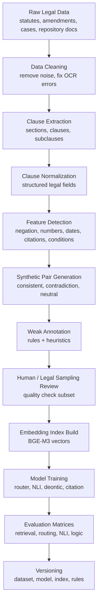

# Training Pipeline

## Purpose

The training pipeline is the offline process used to prepare legal data, train or fine-tune models, evaluate them, and version the resulting artifacts. It is separate from the deployed operational pipeline.

The training pipeline answers this question:

> How do we prepare the models and indexes before users run the system?

## Training Pipeline Overview



## Phase 1 - Data Collection

### Objective

Collect legal data from reliable sources so the system can learn and retrieve Pakistani legal content.

### Inputs

- Pakistani statutes
- Amendments
- Case law references
- Repository documents
- Policy documents
- Legal examples prepared by the team

### Subtasks

| Subtask | Description |
|---|---|
| Source identification | Select official or trusted legal document sources |
| Document download | Collect PDFs, DOCX, TXT, and scanned files |
| File metadata capture | Record source, act name, year, jurisdiction, version |
| Document grouping | Group by statute, act, repository, or legal topic |
| Duplicate detection | Remove duplicate copies of the same law |

### Output

```text
Raw document corpus with metadata.
```

## Phase 2 - Text Extraction

### Objective

Convert documents into usable text.

### Tools

- PaddleOCR for scanned PDFs/images
- PDF parser for digital PDFs
- DOCX parser for Word files
- TXT reader for text files

### Subtasks

| Subtask | Description |
|---|---|
| File type detection | Identify PDF, DOCX, TXT, scanned image |
| OCR routing | Send scanned documents to OCR |
| Text extraction | Extract text from each document |
| Layout preservation | Preserve section numbers and headings |
| Extraction confidence | Store OCR confidence and parser warnings |

### Output

```json
{
  "documentId": "doc_ppc_1860",
  "rawText": "...",
  "extractionMethod": "pdf_parser",
  "confidence": 0.98
}
```

## Phase 3 - Clause Extraction

### Objective

Split long documents into smaller legal units.

### Subtasks

| Subtask | Description |
|---|---|
| Section detection | Detect section/article headings |
| Subclause detection | Detect numbered or lettered clauses |
| Boundary validation | Prevent broken or merged clauses |
| Citation preservation | Keep original section/article reference |
| Clause ID creation | Give every clause a stable ID |

### Output

```json
{
  "clauseId": "ppc_379_main",
  "documentId": "ppc_1860",
  "section": "PPC Section 379",
  "text": "Whoever commits theft shall be punished..."
}
```

## Phase 4 - Clause Normalization

### Objective

Convert each clause into a structured representation that models and rule engines can use.

### Normalized Fields

| Field | Meaning |
|---|---|
| `subject` | Who the clause applies to |
| `action` | What action is required, allowed, or forbidden |
| `modality` | Duty, permission, prohibition, right |
| `condition` | If/provided-that/unless parts |
| `exception` | Clauses that override normal rule |
| `quantity` | Amount, percentage, penalty, duration |
| `date` | Effective date, deadline, amendment date |
| `citation` | Referenced acts, sections, articles |
| `jurisdiction` | Federal, provincial, institutional |
| `version` | Amendment or validity period |

### Output

```json
{
  "clauseId": "ppc_379_main",
  "normalizedText": "theft shall be punished up to 3 years or fine or both",
  "modality": "duty",
  "quantities": ["3 years"],
  "conditions": [],
  "exceptions": [],
  "citations": ["PPC Section 379"]
}
```

## Phase 5 - Feature Detection

### Objective

Detect which categories are present in each clause.

### Feature Categories

| Feature | Examples |
|---|---|
| Negation | not, no, shall not, unless |
| Numbers | amount, fine, years, percentage |
| Dates | deadline, effective date, amendment date |
| Deontic modality | shall, must, may, prohibited |
| Conditions | if, unless, provided that |
| Citations | section, article, act, ordinance |
| Dependencies | this section applies to, subject to |
| Multihop | clause references another clause that references another |
| Category/domain | criminal, cyber, constitutional, terrorism |

### Output

```json
{
  "clauseId": "example_001",
  "features": {
    "hasNumber": true,
    "hasDate": false,
    "hasNegation": false,
    "hasCondition": false,
    "hasCitation": true,
    "category": "criminal"
  }
}
```

## Phase 6 - Synthetic Clause Pair Generation

### Objective

Create training examples for consistency, contradiction, and neutral relationships.

### Pair Types

| Pair Type | Description |
|---|---|
| Consistent pair | New clause matches or supports existing clause |
| Contradiction pair | New clause conflicts with existing clause |
| Neutral pair | Clauses are legally unrelated |
| Exception pair | One clause creates exception to another |
| Priority pair | Conflict is resolved by newer/special/higher law |

### Example

```json
{
  "clauseA": "Punishment may extend to three years.",
  "clauseB": "Punishment may extend to five years.",
  "label": "contradiction",
  "contradictionType": "numeric_penalty_mismatch"
}
```

## Phase 7 - Annotation

### Weak Annotation

Rules generate initial labels.

Examples:

- Different punishment amount for same offense -> contradiction.
- Same clause with paraphrase -> consistent.
- Same citation but opposite modality -> contradiction.
- Different unrelated acts -> neutral.

### Review Sampling

Only selected examples need manual/legal review for quality checking.

Review focus:

- Edge cases
- Low-confidence labels
- Conflicting weak rules
- Highly important legal categories

## Phase 8 - Embedding and Index Building

### Objective

Prepare vectors for retrieval.

### Tool

```text
BGE-M3
```

### Subtasks

| Subtask | Description |
|---|---|
| Embed normalized clause text | Generate vector for every clause |
| Store metadata | Store section, act, category, repository |
| Build vector collection | Store in ChromaDB or vector database |
| Build repository filters | Separate user repository data |
| Validate retrieval | Test that known related clauses are retrievable |

## Phase 9 - Model Training

### Models

| Model | Training Goal |
|---|---|
| DeBERTa-v3 Router | Predict which experts should handle a clause |
| DeBERTa-v3 Legal NLI | Predict entailment, contradiction, neutral |
| DeBERTa-v3 Deontic | Detect obligation, permission, prohibition |
| Legal-BERT NER | Extract citations and legal entities |
| NegBERT | Detect negation cue and scope |

### Training Data

Each model receives a different training view of the normalized data.

Example:

- Router uses detected features and labels.
- NLI uses clause pairs.
- Deontic model uses modality labels.
- Citation model uses token-level entity labels.

## Phase 10 - Evaluation and Versioning

### Evaluation Areas

| Area | Metric |
|---|---|
| Retrieval | Recall@20, MRR, NDCG@5 |
| Router | Precision, recall, F1 per expert |
| NLI | Macro F1 |
| Numeric | Exact match and comparison accuracy |
| Date | Date extraction and interval accuracy |
| Logic | Rule satisfaction and exception accuracy |
| Report | Explanation faithfulness |

### Versioned Artifacts

Every release should store:

- Dataset version
- Model version
- Embedding index version
- Rule version
- Evaluation report
- Error analysis notes

## Training Pipeline Output

The final output of the training pipeline is not a user-facing report. It is a prepared system:

```text
Trained/fine-tuned models
+ vector indexes
+ knowledge graph
+ rules
+ evaluation matrices
+ version metadata
```

This prepared system is then used by the deployed operational pipeline.
