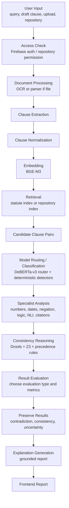
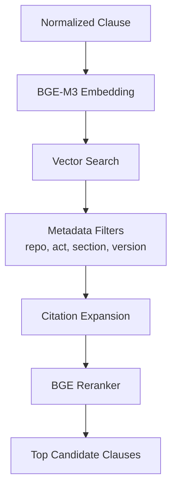

# Deployed Operational Pipeline

## Purpose

The operational pipeline is the runtime flow used when the deployed application receives a user query, uploaded document, repository search request, consistency audit request, or multi-file analysis request.

This pipeline answers:

> What happens after a user submits something in the app?

## Required Main Sequence

The requested sequence is:

```text
After Normalisation
-> Embedding
-> Retrieval
-> Decide Which Model Can Handle It
-> Classification
-> Consistency Reasoning
-> Result Evaluation
-> Preserve Contradiction and Consistency Results
```

## Full Operational Pipeline



## Phase 1 - Input and Access

### Inputs

- Search query
- Draft clause text
- Single uploaded file
- Multiple uploaded files
- Selected repository
- Full-statute search scope

### Subtasks

| Subtask | Description |
|---|---|
| Verify session | Check Firebase authentication |
| Verify repository access | Ensure repository belongs to user |
| Validate file | Check file type and size |
| Assign job ID | Create stable analysis job ID |
| Preserve provenance | Store input source, user ID, timestamp |

## Phase 2 - Data Processing

This phase prepares raw data.

```text
data -> process -> negation, numbers, dates, multihoping/dependencies, categories
```

### Subtasks

| Subtask | Description |
|---|---|
| Extract text | OCR or parser |
| Clean text | Remove OCR noise and repeated spaces |
| Segment clauses | Split into clauses and subclauses |
| Preserve citations | Keep section/article numbers |
| Extract metadata | Act name, section, year, source, repository |

## Phase 3 - Clause Normalization

Normalization converts each clause into a structured legal object.

### Example Input

```text
No person shall appeal after thirty days unless the authority grants an extension.
```

### Normalized Output

```json
{
  "subject": "person",
  "action": "appeal",
  "modality": "prohibition",
  "negation": true,
  "dateOrDuration": "30 days",
  "condition": null,
  "exception": "authority grants an extension"
}
```

## Phase 4 - Embedding

After normalization, embeddings are created.

### Tool

```text
BGE-M3
```

### Why Embedding Happens After Normalization

Embedding raw OCR text can include noise. Normalized clauses are cleaner and more consistent, which improves retrieval.

The embedding should represent:

- Normalized text
- Legal keywords
- Citation context
- Category/domain tags

## Phase 5 - Retrieval

Retrieval finds existing clauses that may be related to the user clause.

### Retrieval Types

| Type | Use |
|---|---|
| Full corpus retrieval | Search across all indexed Pakistani laws |
| Repository retrieval | Search only selected user repository |
| Multi-file retrieval | Search only uploaded temporary files |
| Citation retrieval | Retrieve clauses directly referenced by citation |
| Multihop retrieval | Retrieve clauses linked through dependencies |

### Retrieval Flow



## Phase 6 - Candidate Clause Pair Creation

The system compares the user clause against retrieved candidates.

```json
{
  "pairId": "pair_001",
  "queryClauseId": "user_clause_001",
  "candidateClauseId": "ppc_379",
  "retrievalScore": 0.91,
  "source": "Pakistan Penal Code"
}
```

## Phase 7 - Decide Which Model Can Handle It

This is the classification/routing stage.

The system asks:

| Question | If Yes |
|---|---|
| Does the clause contain numbers, amounts, penalties, ages, percentages? | Send to Number Expert |
| Does it contain dates, deadlines, durations, amendments? | Send to Date Expert |
| Does it contain not/no/unless/except? | Send to Negation Expert |
| Does it contain shall/must/may/prohibited? | Send to Deontic Expert |
| Does it contain if/unless/provided that? | Send to Condition Expert |
| Does it contain citations or cross-references? | Send to Citation Expert |
| Does it require semantic comparison? | Send to Legal NLI Expert |
| Does it depend on another clause or hierarchy? | Send to Multihop/Priority Expert |

This is not a single-choice classifier. It is multi-label classification.

## Phase 8 - Specialist Analysis

Experts run independently and return structured results.

```json
{
  "expertName": "Number Expert",
  "finding": "contradiction",
  "confidence": 0.96,
  "evidence": ["five years", "three years"],
  "reasoning": "The maximum punishment duration differs for the same offense."
}
```

## Phase 9 - Consistency Reasoning

Consistency reasoning combines all expert outputs.

### Reasoning Inputs

- NLI labels
- Numeric comparisons
- Date intervals
- Negation scope
- Deontic modality
- Citation links
- Legal priority rules
- Propositional logic formulas
- Retrieval confidence

### Decision Types

| Decision | Meaning |
|---|---|
| Consistent | New clause supports or matches existing law |
| Contradiction | New clause conflicts with existing law |
| Overlap | Possible legal overlap, but not direct contradiction |
| Exception | Clause modifies or limits another clause |
| Uncertain | Evidence is insufficient or expert outputs conflict |

## Phase 10 - Result Evaluation

The system decides what type of evaluation is required.

Examples:

| Trigger | Evaluation Type |
|---|---|
| Numeric mismatch | Exact numeric comparison |
| Date conflict | Temporal interval evaluation |
| NLI contradiction | Semantic contradiction evaluation |
| Negation found | Polarity/scope evaluation |
| Citation found | Citation correctness evaluation |
| Priority conflict | Legal hierarchy evaluation |
| Low confidence | Calibration/uncertainty evaluation |

## Phase 11 - Preserve Contradiction and Consistency Results

The system must preserve both positive and negative outcomes.

### Why Preservation Matters

If only contradictions are stored, the system loses evidence of clauses that were checked and found consistent. For audit and explanation, both result types matter.

### Stored Result

```json
{
  "analysisId": "analysis_001",
  "pairId": "pair_001",
  "resultType": "contradiction",
  "confidence": 0.94,
  "expertsUsed": ["Number Expert", "Deontic Expert", "Legal NLI Expert"],
  "evidence": ["five years vs three years"],
  "createdAt": "2026-06-21T12:00:00Z"
}
```

## Phase 12 - Explanation and Report

The final report should show:

- Result type
- Confidence
- Clause pair
- Evidence
- Experts used
- Legal reasoning
- Citation source
- Evaluation type

## Operational Pipeline Output

The final output is:

```text
Final Result with Explanation
```

But internally it must preserve:

- Raw input
- Normalized clause
- Embedding/index version
- Retrieved candidates
- Routing decisions
- Expert outputs
- Reasoning trace
- Evaluation metrics
- Final result
