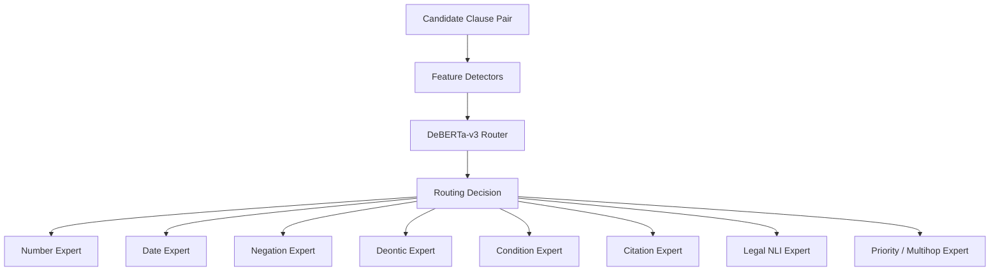

# Classification and Model Routing

## Purpose

This document explains how the system decides which model or specialist component can handle each clause. This happens after clause normalization, embedding, and retrieval.

The routing stage is important because different legal problems require different processing methods.

## Main Idea

The system does not ask:

> Which one model should handle this clause?

Instead, it asks:

> Which group of experts should handle this clause?

This is called multi-label routing.

## Routing Position in Pipeline

```text
Clause Normalization
-> Embedding
-> Retrieval
-> Candidate Clause Pairs
-> Classification / Routing
-> Specialist Models
-> Consistency Reasoning
```

## Why Routing Happens After Retrieval

Routing can happen on the query clause alone, but stronger routing happens after retrieval because the system can compare both sides.

Example:

User clause:

```text
The appeal must be filed within thirty days.
```

Retrieved clause:

```text
The appeal may be filed within fifteen days.
```

The pair reveals:

- `must` vs `may` -> deontic issue
- `thirty days` vs `fifteen days` -> numeric/date issue
- same action `appeal filed` -> semantic comparison needed

## Routing Inputs

The router receives:

| Input | Description |
|---|---|
| Normalized query clause | Structured user clause |
| Retrieved candidate clause | Existing clause from law/repository |
| Detected features | Numbers, dates, negation, citations, conditions |
| Metadata | Act, section, year, repository, source |
| Retrieval score | Relevance confidence |
| Citation links | Direct or indirect legal references |

## Routing Outputs

```json
{
  "pairId": "pair_001",
  "routes": [
    "NumberExpert",
    "DateExpert",
    "DeonticExpert",
    "LegalNLIExpert"
  ],
  "routingReason": [
    "contains duration",
    "contains modal verb must",
    "same legal action requires semantic comparison"
  ]
}
```

## Routing Checks

| Check | Detection Method | Expert |
|---|---|---|
| Numbers, amounts, percentages, penalties | Regex + NER + unit normalization | Number Expert |
| Dates, deadlines, durations, amendment years | Date parser + temporal rules | Date Expert |
| Negation | Negation cue and scope detection | Negation Expert |
| Duties, permissions, prohibitions | Deontic classifier | Deontic Expert |
| Conditions and exceptions | Rule parser + transformer classifier | Condition Expert |
| Citations | Legal NER + citation regex | Citation Expert |
| Similar meaning or contradiction | NLI classifier | Meaning Expert |
| Dependencies and hierarchy | Knowledge graph + rule engine | Priority/Multihop Expert |

## Classification Diagram



## Expert Responsibilities

### Number Expert

Handles:

- Fines
- Imprisonment periods
- Ages
- Percentages
- Ratios
- Monetary limits
- Maximum/minimum values

Example:

```text
three years vs five years
```

Result:

```text
Numeric contradiction
```

### Date Expert

Handles:

- Deadlines
- Validity periods
- Effective dates
- Amendment dates
- Filing windows

Example:

```text
within 30 days vs within 15 days
```

Result:

```text
Temporal inconsistency
```

### Negation Expert

Handles:

- not
- no
- shall not
- unless
- except
- without

Example:

```text
The authority may disclose records.
The authority shall not disclose records.
```

Result:

```text
Polarity contradiction
```

### Deontic Expert

Handles:

- shall
- must
- may
- may not
- prohibited
- entitled

Example:

```text
must submit vs may submit
```

Result:

```text
Obligation/permission mismatch
```

### Condition Expert

Handles:

- if
- unless
- provided that
- subject to
- except where
- nested conditions

Example:

```text
A rule applies unless approval is granted.
```

Result:

```text
Conditional exception detected
```

### Citation Expert

Handles:

- Section references
- Article references
- Acts
- Ordinances
- Cross-references
- Amendment links

Example:

```text
as provided under Section 14 of PECA
```

Result:

```text
Citation link created
```

### Legal NLI Expert

Handles semantic relationship:

- Entailment
- Contradiction
- Neutral

Example:

```text
Clause A says theft punishment is up to 3 years.
Clause B says theft punishment is up to 5 years.
```

Result:

```text
Contradiction
```

### Priority / Multihop Expert

Handles:

- Lex Specialis
- Lex Posterior
- Constitutional hierarchy
- Federal/provincial hierarchy
- Amendment chains
- Dependency links

Example:

```text
Clause A cites Section 14, which depends on Section 2 definition, which was amended later.
```

Result:

```text
Multihop dependency resolved
```

## Routing Pseudocode

```text
function routeClausePair(queryClause, candidateClause):
    features = detectFeatures(queryClause, candidateClause)
    routes = []

    if features.numberDetected:
        routes.add(NumberExpert)

    if features.dateDetected:
        routes.add(DateExpert)

    if features.negationDetected:
        routes.add(NegationExpert)

    if features.deonticDetected:
        routes.add(DeonticExpert)

    if features.conditionDetected:
        routes.add(ConditionExpert)

    if features.citationDetected:
        routes.add(CitationExpert)

    if features.semanticSimilarityHigh:
        routes.add(LegalNLIExpert)

    if features.requiresDependencyOrPriority:
        routes.add(PriorityMultihopExpert)

    if routes is empty:
        routes.add(GeneralSemanticExpert)

    return routes
```

## Deterministic Rules vs Model Guessing

Some routing decisions should not depend only on a model.

| Feature | Preferred Detector |
|---|---|
| Exact number | Regex + parser |
| Date | Temporal parser |
| Citation | Regex + legal NER |
| Negation cue | Rule list + NegBERT |
| Deontic term | Term list + classifier |
| Semantic contradiction | Legal NLI model |

This avoids using a language model for tasks that require exact computation.

## Routing Confidence

Each route should include a confidence score.

```json
{
  "expert": "DateExpert",
  "confidence": 0.93,
  "trigger": "within 30 days"
}
```

Low routing confidence should not stop analysis. It should mark the result as uncertain if final reasoning depends on weak evidence.

## Final Routing Principle

The router should be inclusive.

It is better to send a clause to one extra relevant expert than to miss an expert needed for legal reasoning. Missing an expert can hide contradictions.
