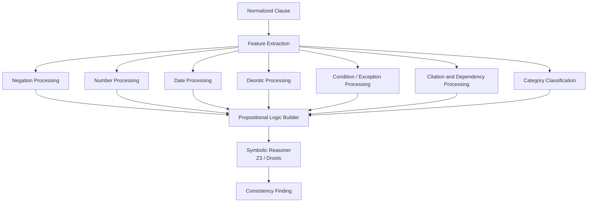

# Complete Processing and Propositional Logic

## Purpose

This document explains complete clause processing: negation, numbers, dates, categories, multihop dependencies, and propositional logic conversion.

This is the deeper part of the system that turns legal language into structured reasoning.

## Full Processing Sequence

```text
Data
-> Text Processing
-> Clause Extraction
-> Clause Normalization
-> Feature Processing
-> Logic Conversion
-> Specialist Reasoning
-> Consistency Decision
```

## Processing Categories

The system should identify these categories:

| Category | Purpose |
|---|---|
| Negation | Detect meaning reversal |
| Numbers | Compare amounts, limits, penalties |
| Dates | Compare deadlines and validity periods |
| Deontic modality | Detect duty, permission, prohibition |
| Conditions | Understand if/unless/provided-that |
| Exceptions | Detect rules that override general rules |
| Citations | Link referenced sections and acts |
| Dependencies | Find clauses that depend on other clauses |
| Multihop reasoning | Follow multiple linked clauses |
| Legal category | Criminal, cyber, constitutional, civil, terrorism |
| Propositional logic | Convert clause meaning into symbols |

## Negation Processing

### Goal

Negation processing detects when the clause meaning is reversed.

### Examples

| Text | Meaning |
|---|---|
| `shall disclose` | duty to disclose |
| `shall not disclose` | prohibition on disclosure |
| `unless permission is granted` | exception condition |
| `no person may enter` | prohibition |

### Steps

1. Detect negation cue.
2. Find negation scope.
3. Identify action being negated.
4. Update normalized modality.
5. Send to NegBERT if scope is complex.

### Output

```json
{
  "hasNegation": true,
  "negationCue": "shall not",
  "scope": "disclose records",
  "normalizedMeaning": "prohibited(disclose_records)"
}
```

## Number Processing

### Goal

Number processing extracts and compares exact values.

### Examples

- `three years`
- `5 years`
- `five million rupees`
- `30%`
- `under the age of eighteen`

### Steps

1. Detect numeric expression.
2. Convert words to digits.
3. Normalize units.
4. Identify legal role of number.
5. Compare values.

### Output

```json
{
  "quantity": "5 years",
  "normalizedValue": 5,
  "unit": "year",
  "role": "maximum_imprisonment"
}
```

### Contradiction Example

| Clause A | Clause B | Result |
|---|---|---|
| punishment up to 3 years | punishment up to 5 years | numeric contradiction |

## Date Processing

### Goal

Date processing handles deadlines, amendment dates, and validity periods.

### Examples

- `within 30 days`
- `before 1 January 2027`
- `after commencement of this Act`
- `effective from 2024`

### Steps

1. Detect date or duration.
2. Normalize date format.
3. Convert durations into intervals.
4. Compare intervals.
5. Apply amendment/version metadata.

### Output

```json
{
  "dateExpression": "within 30 days",
  "type": "deadline",
  "durationDays": 30
}
```

## Deontic Processing

### Goal

Deontic processing identifies legal force.

| Term | Meaning |
|---|---|
| shall | duty |
| must | duty |
| may | permission |
| shall not | prohibition |
| prohibited | prohibition |
| entitled | right |

### Output

```json
{
  "modality": "duty",
  "action": "submit application"
}
```

## Condition and Exception Processing

### Goal

Conditions and exceptions determine when a rule applies or does not apply.

### Examples

| Text | Processing |
|---|---|
| if the applicant is registered | condition |
| unless approval is granted | exception |
| provided that the fee is paid | condition |
| subject to section 12 | dependency |

### Output

```json
{
  "rule": "duty(submit_application)",
  "condition": "registered(applicant)",
  "exception": "approval_granted(authority)"
}
```

## Categories

The system should classify clauses into legal categories.

| Category | Examples |
|---|---|
| Criminal | PPC theft, punishment, offense |
| Cyber | PECA identity misuse, digital fraud |
| Constitutional | fundamental rights, property, dignity |
| Civil | contracts, property, obligations |
| Terrorism | ATA offenses, coercion, public fear |
| Administrative | authority powers, procedure, deadlines |
| Institutional | university policy, attendance, discipline |

Categories improve retrieval and routing.

## Dependency Processing

### Goal

Dependency processing detects when a clause depends on another clause.

### Examples

```text
Subject to Section 12...
As defined in Section 2...
Notwithstanding anything contained in...
Provided under Article 24...
```

### Dependency Output

```json
{
  "clauseId": "clause_10",
  "dependsOn": ["section_2_definition", "section_12_condition"],
  "dependencyType": "definition_and_condition"
}
```

## Multihop Reasoning

Multihop reasoning follows chains of legal references.

Example:

```text
Clause A refers to Section 10.
Section 10 refers to definition in Section 2.
Section 2 was amended in 2024.
```

The system must follow:

```text
Clause A -> Section 10 -> Section 2 -> Amendment 2024
```

Without multihop reasoning, the system may compare against an outdated definition.

## Propositional Logic Conversion

### Purpose

Propositional logic converts legal meaning into structured symbolic rules.

This helps with:

- Consistency checking
- Contradiction detection
- Exception handling
- Dependency reasoning
- Rule comparison

## Basic Symbols

| Symbol | Meaning |
|---|---|
| `P` | Person commits theft |
| `Q` | Person is punished |
| `R` | Punishment up to 3 years |
| `S` | Punishment up to 5 years |
| `E` | Exception applies |
| `D` | Duty exists |
| `F` | Prohibition exists |

## Example 1 - Simple Duty

Text:

```text
A person shall submit the application.
```

Logic:

```text
Person(x) -> Duty(submit_application(x))
```

## Example 2 - Negation

Text:

```text
A person shall not disclose the record.
```

Logic:

```text
Person(x) -> Prohibited(disclose_record(x))
```

or:

```text
Person(x) -> NOT Permitted(disclose_record(x))
```

## Example 3 - Condition

Text:

```text
If the applicant is registered, the authority shall issue a certificate.
```

Logic:

```text
Registered(applicant) -> Duty(authority, issue_certificate)
```

## Example 4 - Exception

Text:

```text
A person shall submit the form within 30 days unless an extension is granted.
```

Logic:

```text
NOT ExtensionGranted(person) -> Duty(submit_form_within_30_days)
ExtensionGranted(person) -> Exception(duty_deadline_30_days)
```

## Example 5 - Contradiction

Clause A:

```text
The punishment may extend to three years.
```

Clause B:

```text
The punishment may extend to five years.
```

Logic:

```text
MaxPunishment(theft) = 3_years
MaxPunishment(theft) = 5_years
```

Contradiction rule:

```text
same_offense AND different_max_punishment -> contradiction
```

## Complete Processing Diagram



## Final Processing Output

```json
{
  "clauseId": "clause_001",
  "features": {
    "negation": false,
    "numbers": ["5 years"],
    "dates": [],
    "modality": "duty",
    "category": "criminal",
    "dependencies": ["PPC Section 379"]
  },
  "logic": [
    "Offense(theft) -> MaxPunishment(5_years)"
  ],
  "candidateContradictions": [
    "PPC Section 379 has MaxPunishment(3_years)"
  ]
}
```

## Key Principle

Language models help understand text, but legal consistency needs structured processing. Propositional logic and symbolic tools provide the exactness needed for numbers, dates, negation, exceptions, and dependencies.
