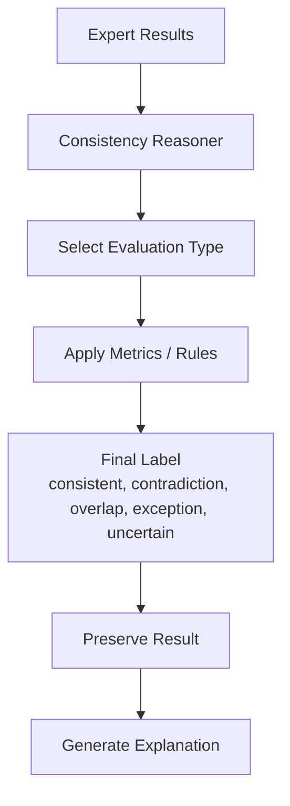

# Evaluation Matrices and Result Preservation

## Purpose

This document explains how the system should evaluate outputs and preserve contradiction and consistency results.

After consistency reasoning, the system must not simply show a final label. It must evaluate the result type, confidence, evidence, and whether the output should be preserved as contradiction, consistency, overlap, exception, or uncertain.

## Evaluation Stage in Pipeline

```text
Specialist Outputs
-> Consistency Reasoning
-> Result Evaluation
-> Result Type Decision
-> Preserve Contradiction and Consistency Results
-> Explanation Report
```

## Result Types

| Result Type | Meaning |
|---|---|
| Consistent | New clause agrees with or supports existing law |
| Contradiction | New clause conflicts with existing law |
| Overlap | Clauses cover similar area but do not directly contradict |
| Exception | One clause limits or overrides another |
| Uncertain | Evidence is insufficient or model/rule outputs disagree |

## Evaluation Type Selection

Different legal problems require different evaluation matrices.

| Trigger | Evaluation Type | Example |
|---|---|---|
| Numbers or penalties | Numeric exact comparison | 3 years vs 5 years |
| Dates or deadlines | Temporal interval evaluation | 15 days vs 30 days |
| Negation | Polarity/scope evaluation | may disclose vs shall not disclose |
| Semantic similarity | NLI evaluation | entailment/contradiction/neutral |
| Citations | Citation correctness evaluation | Section 14 PECA reference |
| Dependencies | Multihop evaluation | Section 10 -> Section 2 -> amendment |
| Legal priority | Precedence evaluation | special law vs general law |
| Low confidence | Calibration evaluation | uncertain result |

## Matrix 1 - Classification Confusion Matrix

Used for final consistency result classification.

| Actual / Predicted | Consistent | Contradiction | Overlap | Exception | Uncertain |
|---|---:|---:|---:|---:|---:|
| Consistent | TP-C | FN | FN | FN | FN |
| Contradiction | FN | TP-X | FN | FN | FN |
| Overlap | FN | FN | TP-O | FN | FN |
| Exception | FN | FN | FN | TP-E | FN |
| Uncertain | FN | FN | FN | FN | TP-U |

Metrics:

- Accuracy
- Macro F1
- Per-class precision
- Per-class recall
- Confusion rate between contradiction and overlap

## Matrix 2 - Router Evaluation Matrix

Used to evaluate whether the system selected the correct experts.

| Expert | Precision | Recall | F1 | False Positive Risk | False Negative Risk |
|---|---:|---:|---:|---|---|
| Number Expert | TBD | TBD | TBD | Extra processing | Miss numeric contradiction |
| Date Expert | TBD | TBD | TBD | Extra processing | Miss deadline conflict |
| Negation Expert | TBD | TBD | TBD | Extra processing | Reverse meaning missed |
| Deontic Expert | TBD | TBD | TBD | Extra processing | Miss duty/permission issue |
| Condition Expert | TBD | TBD | TBD | Extra processing | Miss exception |
| Citation Expert | TBD | TBD | TBD | Extra processing | Miss legal reference |
| NLI Expert | TBD | TBD | TBD | Extra processing | Miss semantic contradiction |
| Priority Expert | TBD | TBD | TBD | Extra processing | Miss legal hierarchy issue |

Important:

Router recall is more important than router precision because missing the correct expert can hide a contradiction.

## Matrix 3 - Retrieval Evaluation Matrix

Used for embedding and retrieval.

| Metric | Meaning | Target |
|---|---|---|
| Recall@5 | Correct clause appears in top 5 | High |
| Recall@20 | Correct clause appears in top 20 | Very high |
| MRR | Correct clause rank quality | High |
| NDCG@5 | Ranking quality with relevance grades | High |
| Repository filter accuracy | Correct repository restriction | 100% |
| Citation retrieval accuracy | Direct citation resolves correctly | Very high |

## Matrix 4 - NLI Evaluation Matrix

Used for entailment, contradiction, and neutral classification.

| Actual / Predicted | Entailment | Contradiction | Neutral |
|---|---:|---:|---:|
| Entailment | TP-E | Error | Error |
| Contradiction | Error | TP-C | Error |
| Neutral | Error | Error | TP-N |

Metrics:

- Macro F1
- Contradiction recall
- Neutral precision
- Calibration by confidence bucket

Why contradiction recall matters:

Missing a contradiction is more dangerous than incorrectly flagging a harmless overlap.

## Matrix 5 - Numeric Evaluation Matrix

Used for amounts, penalties, ages, percentages, and durations.

| Test Type | Expected Check | Example |
|---|---|---|
| Exact extraction | Extract same value from text | `five years` -> `5 years` |
| Unit conversion | Normalize unit | `12 months` -> `1 year` |
| Comparison | Detect greater/lesser/equal | 5 years > 3 years |
| Range logic | Detect within/outside range | 18-60 years |
| Penalty role | Identify legal role | fine, imprisonment, age limit |

Metrics:

- Exact match
- Unit normalization accuracy
- Comparison accuracy
- Role classification accuracy

## Matrix 6 - Temporal Evaluation Matrix

Used for dates and deadlines.

| Test Type | Expected Check | Example |
|---|---|---|
| Date extraction | Extract exact date | 1 Jan 2026 |
| Duration extraction | Extract duration | within 30 days |
| Interval comparison | Compare periods | 15 days vs 30 days |
| Amendment validity | Newer version applies | 2024 amendment overrides 2020 text |
| Deadline conflict | Detect mismatch | appeal deadline changed |

Metrics:

- Date exact match
- Duration exact match
- Interval comparison accuracy
- Amendment/version correctness

## Matrix 7 - Propositional Logic Evaluation Matrix

Used for conditions, exceptions, and symbolic reasoning.

| Logic Case | Expected Result |
|---|---|
| `P -> Q` and `P -> Q` | consistent |
| `P -> Q` and `P -> NOT Q` | contradiction |
| `P -> Q unless E` and `E=true` | exception applies |
| `P -> Q if C` and `C=false` | rule not triggered |
| `GeneralRule -> Q`, `SpecialRule -> NOT Q` | priority reasoning needed |

Metrics:

- Rule parsing accuracy
- Exception handling accuracy
- Satisfiability correctness
- Contradiction detection accuracy

## Matrix 8 - Explanation Evaluation Matrix

Used to evaluate generated reports.

| Criterion | Meaning |
|---|---|
| Faithfulness | Explanation only uses verified evidence |
| Citation correctness | Cited section matches retrieved clause |
| Reasoning trace | Steps are shown clearly |
| No hallucination | No unsupported legal claims |
| User clarity | Non-technical user can understand |
| Completeness | Includes result, evidence, confidence |

## Preserving Contradiction and Consistency Results

The system must store both contradiction and consistency outputs.

### Why Store Contradictions?

Contradictions are needed for:

- Reports
- Legal review
- Error analysis
- Model improvement
- Dataset generation

### Why Store Consistency Results?

Consistency results are also important because they prove that the system checked clauses and found no issue.

They help:

- Avoid repeated checks
- Improve confidence
- Build positive training examples
- Show audit trace
- Measure false negative risk

## Result Preservation Schema

```json
{
  "analysisId": "analysis_001",
  "resultId": "result_001",
  "queryClauseId": "user_clause_001",
  "candidateClauseId": "ppc_379",
  "resultType": "contradiction",
  "severity": "high",
  "confidence": 0.94,
  "evaluationTypes": [
    "numeric_comparison",
    "semantic_nli",
    "citation_match"
  ],
  "expertsUsed": [
    "NumberExpert",
    "LegalNLIExpert",
    "CitationExpert"
  ],
  "evidence": [
    "five years",
    "three years",
    "PPC Section 379"
  ],
  "reasoningTrace": [
    "same offense detected",
    "different maximum punishment detected",
    "no newer amendment detected"
  ],
  "modelVersions": {
    "router": "deberta-v3-router-v1",
    "nli": "deberta-v3-legal-nli-v1",
    "retriever": "bge-m3-index-v1"
  },
  "createdAt": "2026-06-21T12:00:00Z"
}
```

## Report Preservation Table

| Field | Required | Reason |
|---|---|---|
| Analysis ID | Yes | Links all result rows |
| Clause IDs | Yes | Traceability |
| Result type | Yes | Main output |
| Confidence | Yes | User trust and calibration |
| Experts used | Yes | Explain routing |
| Evidence | Yes | Grounded report |
| Reasoning trace | Yes | Auditability |
| Model/index versions | Yes | Reproducibility |
| Timestamp | Yes | Audit history |

## Final Evaluation Flow



## Key Rule

Do not overwrite intermediate results. The final report should be generated from preserved evidence, not from memory or a single final label.
